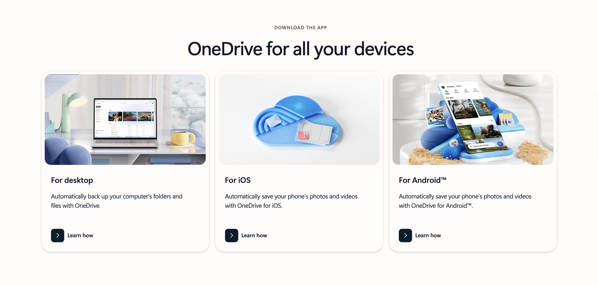

# OneDrive Clone

A full-stack cloud storage application built with Next.js, Express, TypeScript, and Supabase, offering file management, sharing, and real-time collaboration features.

## Live Demo

🚀 **Frontend**: https://onedrive-frontend.vercel.app

🔧 **Backend API**: https://onedrive-backend.vercel.app

## Screenshots



## Features

- **File Management**: Upload, download, delete, and organize files in folders
- **File Sharing**: Share files with other users with customizable permissions
- **Real-time Updates**: Live notifications for file changes and sharing activities
- **Version Control**: Track file versions and restore previous versions
- **Comments**: Add comments to files for collaboration
- **Search**: Full-text search across all files and folders
- **Favorites**: Mark important files as favorites for quick access
- **Trash**: Recover deleted files from trash
- **Admin Dashboard**: Monitor system usage and manage users
- **Responsive Design**: Works seamlessly on desktop and mobile devices

## Tech Stack

### Frontend
- Next.js 14 with App Router
- TypeScript
- Tailwind CSS
- Shadcn/ui Components
- TanStack Query for data fetching
- Socket.io Client for real-time updates

### Backend
- Express.js
- TypeScript
- Supabase for authentication and database
- Socket.io for WebSocket connections
- Multer for file uploads
- Sharp for image processing

### Infrastructure
- PostgreSQL (via Supabase)
- Supabase Storage for file storage
- Docker support for containerization
- Vercel for deployment

## Prerequisites

- Node.js 20 or higher
- npm or yarn
- Supabase account
- Docker (optional)

## Environment Variables

Create `.env` files in both frontend and backend directories:

### Backend (.env)
```
PORT=5001
NODE_ENV=development
SUPABASE_URL=your_supabase_url
SUPABASE_ANON_KEY=your_supabase_anon_key
SUPABASE_SERVICE_ROLE_KEY=your_supabase_service_role_key
FRONTEND_URL=http://localhost:3000
CORS_ORIGINS=http://localhost:3000
MAX_FILE_SIZE=5368709120
ALLOWED_FILE_TYPES=image/*,application/pdf,text/*,application/msword,application/vnd.openxmlformats-officedocument.wordprocessingml.document,application/vnd.ms-excel,application/vnd.openxmlformats-officedocument.spreadsheetml.sheet,application/vnd.ms-powerpoint,application/vnd.openxmlformats-officedocument.presentationml.presentation,application/zip,application/x-zip-compressed,video/*,audio/*
```

### Frontend (.env.local)
```
NEXT_PUBLIC_API_URL=http://localhost:5001/api
NEXT_PUBLIC_SOCKET_URL=http://localhost:5001
NEXT_PUBLIC_SUPABASE_URL=your_supabase_url
NEXT_PUBLIC_SUPABASE_ANON_KEY=your_supabase_anon_key
```

## Installation

### Manual Setup

1. Clone the repository
```bash
git clone https://github.com/Algoace1403/OneDrive-clone.git
cd OneDrive-clone
```

2. Install backend dependencies
```bash
cd backend
npm install
```

3. Install frontend dependencies
```bash
cd ../frontend
npm install
```

4. Set up Supabase
   - Create a new Supabase project
   - Run the SQL migrations in `backend/supabase/migrations`
   - Update environment variables with your Supabase credentials

5. Build the backend
```bash
cd backend
npm run build
```

6. Start the backend
```bash
npm start
```

7. Start the frontend (in a new terminal)
```bash
cd frontend
npm run dev
```

### Docker Setup

1. Clone the repository and create `.env` file from `.env.example`
```bash
cp .env.example .env
```

2. Update the `.env` file with your Supabase credentials

3. Build and run with Docker Compose
```bash
docker-compose up --build
```

The application will be available at:
- Frontend: http://localhost:3000
- Backend API: http://localhost:5001

## API Endpoints

### Authentication
- `POST /api/auth/register` - Register new user
- `POST /api/auth/login` - Login user
- `POST /api/auth/logout` - Logout user
- `GET /api/auth/me` - Get current user
- `PUT /api/auth/profile` - Update profile
- `POST /api/auth/refresh` - Refresh token
- `POST /api/auth/reset-password` - Reset password

### Files
- `GET /api/files` - List files and folders
- `POST /api/files/upload` - Upload file
- `GET /api/files/:id` - Get file details
- `PUT /api/files/:id` - Update file
- `DELETE /api/files/:id` - Delete file
- `PATCH /api/files/:id/favorite` - Toggle favorite
- `GET /api/files/:id/download` - Download file
- `GET /api/files/recent` - Get recent files
- `GET /api/files/favorites` - Get favorites
- `GET /api/files/trash` - Get trash items
- `POST /api/files/:id/restore` - Restore from trash
- `GET /api/files/search` - Search files

### Folders
- `POST /api/folders` - Create folder
- `PUT /api/folders/:id` - Update folder
- `DELETE /api/folders/:id` - Delete folder

### Sharing
- `POST /api/share/:fileId` - Share file
- `GET /api/files/:id/shares` - Get file shares
- `DELETE /api/files/shares/:shareId` - Remove share
- `PATCH /api/share/:fileId/:shareId` - Update permissions

### Comments
- `GET /api/files/:id/comments` - Get comments
- `POST /api/files/:id/comments` - Add comment
- `PUT /api/files/:id/comments/:commentId` - Update comment
- `DELETE /api/files/:id/comments/:commentId` - Delete comment

## Deployment

### Vercel Deployment

Both frontend and backend are configured for Vercel deployment.

#### Backend Deployment
1. Install Vercel CLI: `npm i -g vercel`
2. Run `vercel` in the backend directory
3. Configure environment variables in Vercel dashboard

#### Frontend Deployment
1. Run `vercel` in the frontend directory
2. Update `NEXT_PUBLIC_API_URL` to your backend URL
3. Configure environment variables in Vercel dashboard

### Docker Deployment

Build production images:
```bash
docker-compose -f docker-compose.yml build
docker-compose -f docker-compose.yml up -d
```

## Development

### Running Tests
```bash
cd backend
npm test
```

### Code Style
- ESLint and Prettier are configured
- Run `npm run lint` to check code style
- Run `npm run format` to format code

### Database Migrations
- Migrations are in `backend/supabase/migrations`
- Apply migrations through Supabase dashboard

## Architecture

```
onedrive-clone/
├── frontend/               # Next.js frontend application
│   ├── app/               # App router pages
│   ├── components/        # React components
│   ├── lib/              # Utilities and hooks
│   └── public/           # Static assets
├── backend/               # Express backend application
│   ├── src/
│   │   ├── controllers/  # Route controllers
│   │   ├── services/     # Business logic
│   │   ├── routes/       # API routes
│   │   ├── middleware/   # Express middleware
│   │   └── config/       # Configuration files
│   └── dist/             # Compiled JavaScript
└── docker-compose.yml     # Docker configuration
```

## Security

- JWT-based authentication
- Role-based access control
- File type validation
- Size limit enforcement
- CORS configuration
- Input validation and sanitization

## Performance

- Image optimization with Sharp
- Lazy loading for file lists
- Pagination for large datasets
- Caching with React Query
- Optimized database queries

## Contributing

1. Fork the repository
2. Create a feature branch: `git checkout -b feature-name`
3. Commit changes: `git commit -m 'Add feature'`
4. Push to branch: `git push origin feature-name`
5. Submit a pull request

## License

MIT License

## Support

For issues and questions, please open a GitHub issue or contact support.
